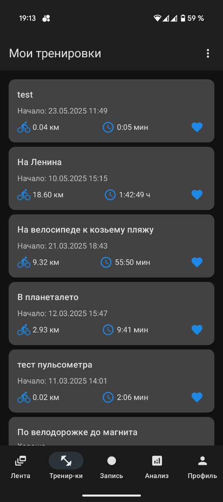

# Ridecorder • Android client

<p align="center">
  
</p>

**Ridecorder** — open-source приложение для записи и анализа велосипедных тренировок.  
Лёгкий Jetpack Compose UI, запись GPS-треков в реальном времени и синхронизация с [собственным сервером Ridecorder](https://github.com/vitalto/ridecorder-api).

---

## Features
* 📍 **Live-tracking**: скорость, дистанция, набор высоты  
* 🗺️ **Map view** с отрисовкой пройденного маршрута (Yandex Maps)  
* 📊 **Статистика**: графики мощности, каденса, HR (BLE-датчики)  
* 🔄 **Синхронизация** с сервером через REST/JSON  
* 🌚 Полная поддержка тёмной темы, Material 3  
* 🔌 Offline-режим: все данные кешируются в Room-БД

## Tech Stack

| Layer | Libs |
|-------|------|
| UI | **Kotlin + Jetpack Compose** |
| DI | **Hilt** |
| Network | **Retrofit 2 + OkHttp 3** |
| DB | **Room** |
| Maps | Yandex Maps SDK |

## Quick start

```bash
git clone https://github.com/vital/ridecorder
cd ridecorder
./gradlew installDebug
# подключите телефон по ADB или запустите эмулятор
````

По умолчанию приложение ожидает сервер на `http://localhost`.
Адрес можно изменить в `local.properties`:

```
ridecorder.backendUrl=https://your-server
ridecorder.mapsApiKey=yandex-maps-api-key
```

## License

Ridecorder-app распространяется под **GNU General Public License v3.0**.
См. файл [LICENSE](./LICENSE) для подробностей.
